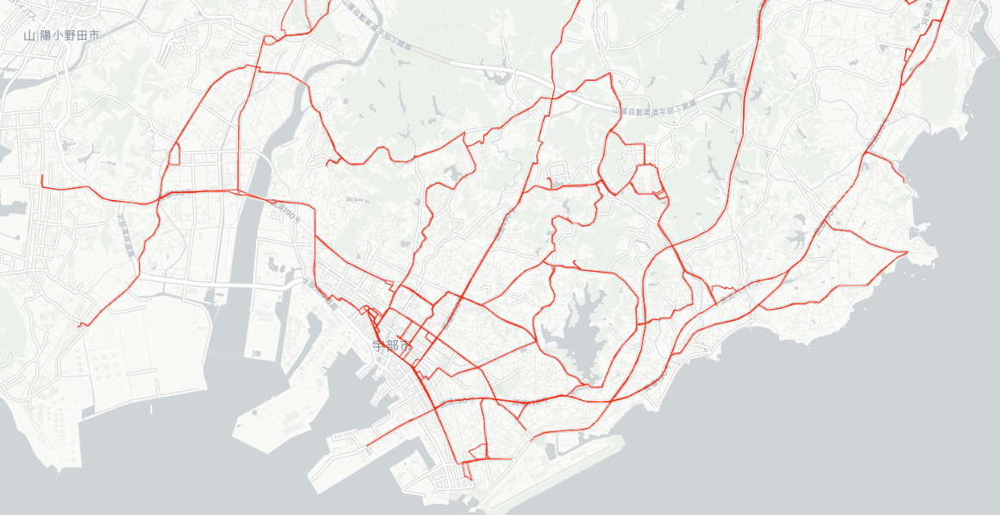
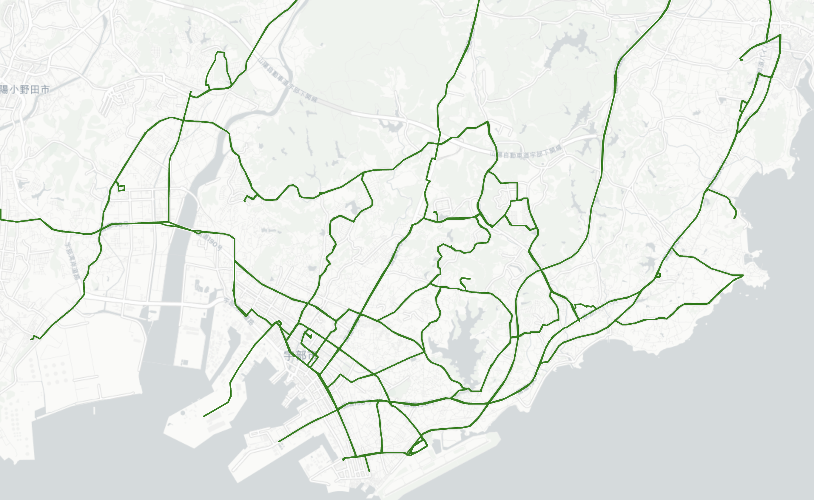
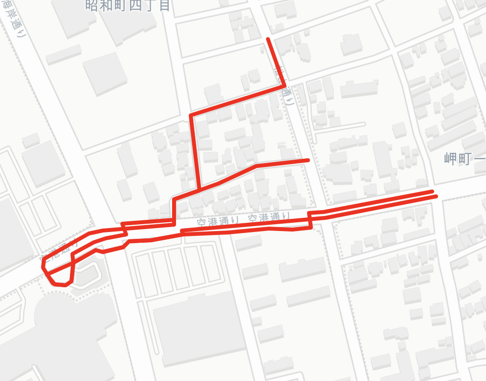
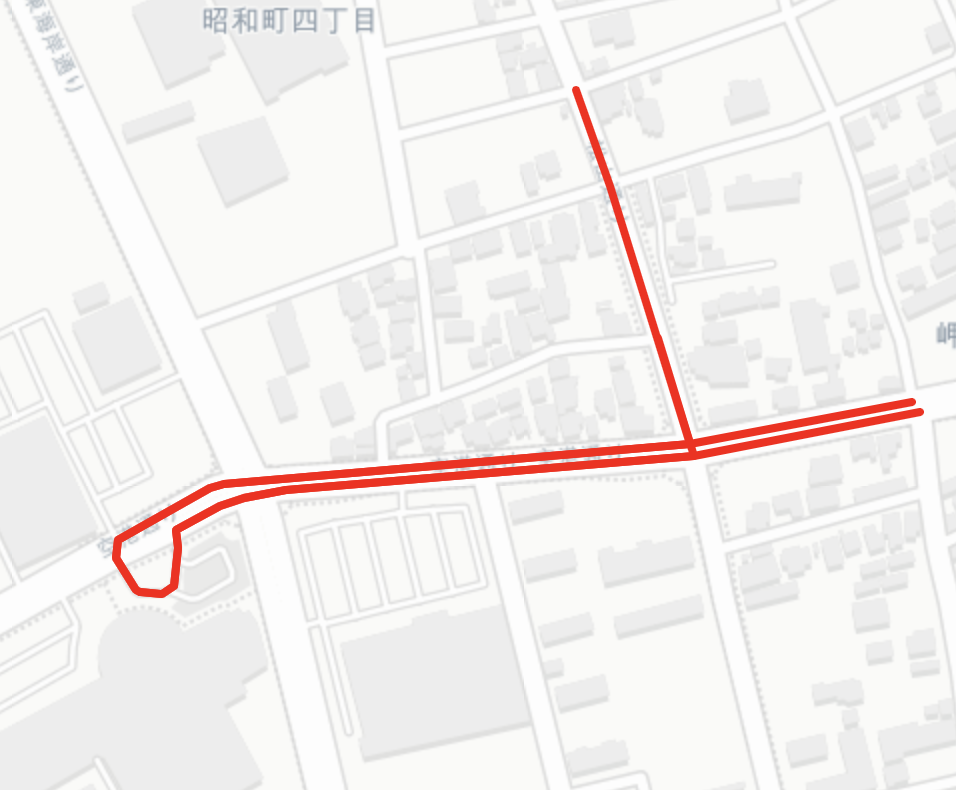

# 経路生成システム (Route Generation System)

## 概要

本アルゴリズムは、公共交通機関のODデータ（起点・終点データ）に基づき、経路を地図上に可視化するためのアルゴリズムです。PythonのOSMnxライブラリを活用して、駅間の最短経路を計算し、必要に応じて経路補正アルゴリズムを適用します。

## 動作フロー

### 1. 最寄りノードの特定とネットワーク選択

各駅座標について、以下のロジックで最寄りノードを検索します。

### 2. OD間の経路計算

各駅の最寄りノードに対して、使用するネットワークを選別します。Allネットワークはノード数が多く計算に時間がかかるため、両駅がDriveネットワークの場合はDriveネットワークを使用し、いずれかの駅がAllネットワークの場合は、やむを得ずAllネットワークを使用します。

#### ネットワークの選択基準

| ネットワーク種別 | 特徴 | 使用場面 |
|----------------|------|----------|
| **drive** | 車道のみのネットワーク、ノード数が少ない、計算効率が良い | バス停の最寄りノードがdriveネットワーク上にある場合 |
| **all** | 歩道・自転車道なども含む、ノード数が多い、計算コストが高い | バス停の最寄りノードがdriveネットワーク上にない場合 |

- 選択したネットワークを用いて、OD間の経路を算出します。
- 経路が正しいか確認します。

### 3. 経路補正

実際の経路と異なる経路は、通過する中間ノードを与え、そのノードを通過して最短経路を算出します。

#### 全体経路修正前後

*全体経路修正前の状態*

*全体経路修正後の状態*

#### 部分経路修正前後

*部分経路修正前の状態*

*部分経路修正後の状態*
